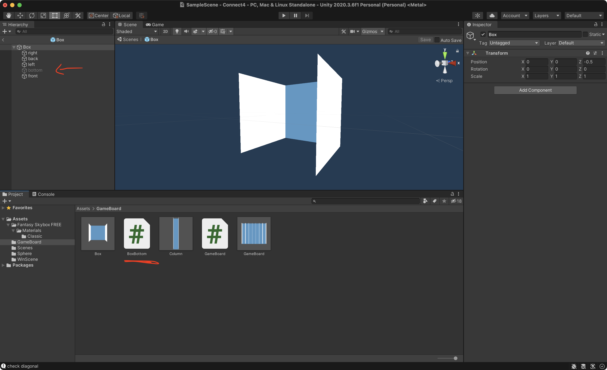

# UnityConnect4
Connect4 built with Unity and C#

## Topics covered:
- 2D & 3D coliders and RigidBody;
- Collition Matrix;
- Setting gravity on/off programatically;
- Skybox;
- Creating reusable Prefabs;
- Multiple Scenes;
- Assigning object's dependencies inside inspector;

## Solution:

Whenever a box was "filled" I turned the above box's bottom enabled:

The box is a reusable Prefab with the bottom disabled by default:

A column is a collection of rows. Each row is just a box. The last row has the bottom enabled by default:

The camera has a slight rotation to make sure it shows the walls:

The winning scene is a simple canvas with some elements from UnityEngine.UI:

